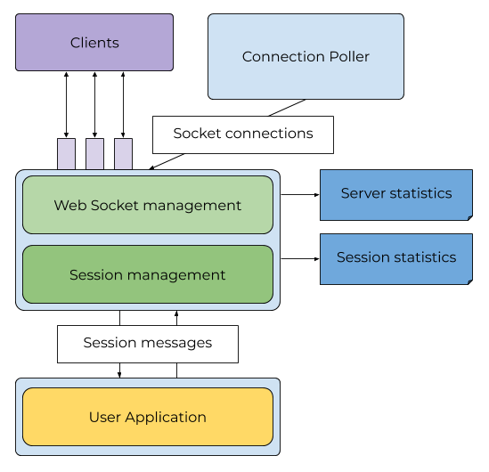
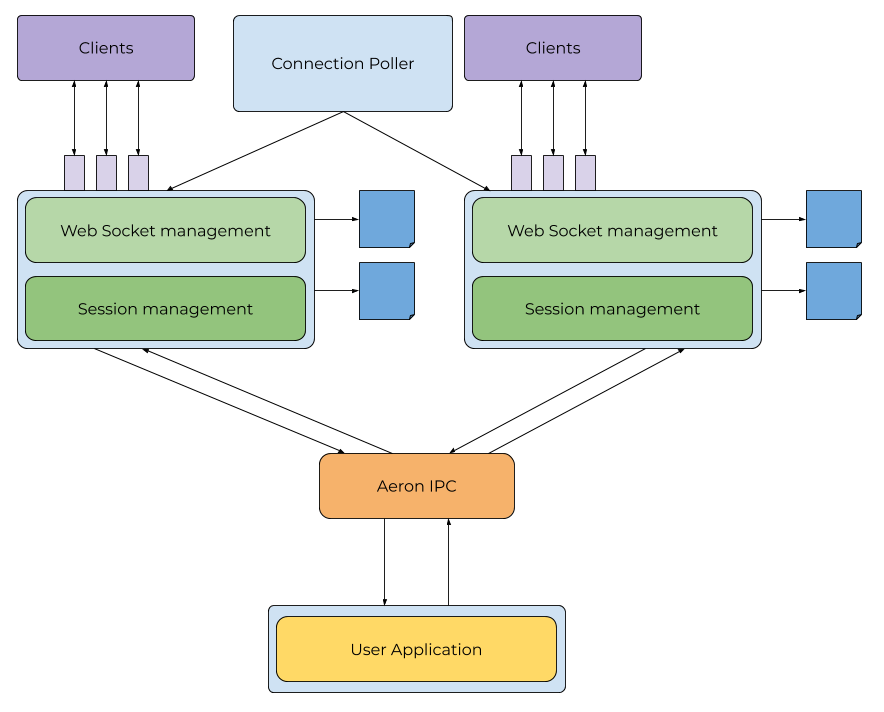

+++
title = "Architecture"
weight = 4
+++

**Babl** server is composed of two main parts - the _session container_ responsible for handling web-socket connections, 
and the _application_ an implementation of the `Application` interface that implements business logic.

The session container performs network I/O and protocol translation, sending received messages to the application.

The application sends messages back to the session container (to a specific session), where it will be converted back
into the web-socket protocol (and fragmented if needed).

The session container is also responsible for tracking liveness of sessions, sending `PING` messages and receiving 
`PONG` messages, on the application's behalf, to ensure that client connections are still active.

The session container also maintains statistics on the server as a whole, and active sessions. 
More information can be found in [Monitoring](@/monitoring/_index.md).

Depending on deployment and scaling requirements, the session container can communicate with the application directly.
In this mode, non-blocking network I/O and protocol translation is performed on the same thread as application
message processing.

`DIRECT` mode is useful for simple deployments when sufficient client connections can be handled on a single thread.
Alternatively, for completely stateless applications that are merely gateways to a stateful back-end, multiple 
instances of the session container can be run. 

For better scalability, **Babl** can be configured to run in `DETACHED` mode where multiple session containers
communicate with a single application instance over an efficient IPC mechanism. This mode allows the work of 
performing I/O and protocol translation to be scaled horizontally, while still allowing the application to 
run in a single-threaded context. 

Deployment mode is configured by setting the following system property on the command-line, or in a configuration file:

`babl.server.deployment.mode`

Valid values are:

   * `DIRECT`
   * `DETACHED`

See [Configuration](@/config/_index.md) for more information on configuration options.

## Direct mode

In `DIRECT` mode, your application logic is executed directly as messages are received from web-socket clients.
Sessions are processed in the order provided by the operating system in response to an `epoll` call. 

## Detached mode

In `DETACHED` mode, one or more session containers will send received messages to the application over
[Aeron](https://github.com/real-logic/Aeron) IPC. 
The application container will poll the IPC transport for new messages, and pass them to the 
application. When the application sends a response to a `Session` via the `send` method, the response
is written to the IPC, and delivered to the originating session container.

Sending to a `Session` will return a `SendResult` value, which must be checked by the application. 
In the event that session containers are not able to keep up with the message flow out of the application,
the `send` method will return `SendResult.BACK_PRESSURE`. It is up to the application to decide what to
do at this point.

### Multi-Runtime Support

Messages exchanged between the session container and the application are encoded using 
[SBE](https://github.com/real-logic/simple-binary-encoding), so any supported language runtime
using Aeron (via C FFI or native client) can host the application logic. This makes the session container
a runtime- and language-agnostic web-socket server.